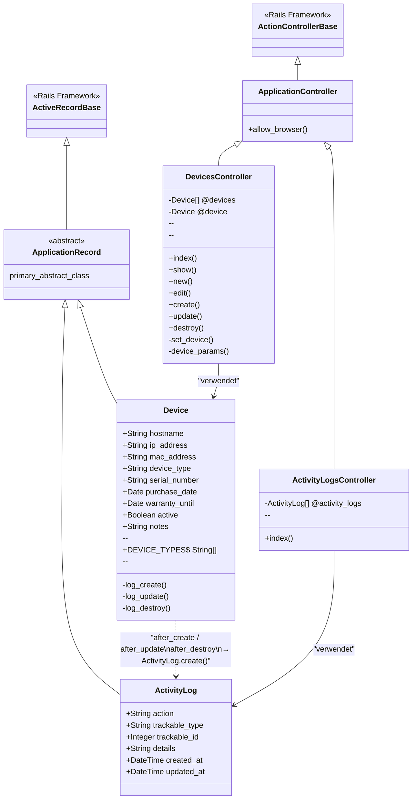

# Klassendiagramm – IT-Verwaltung

## Hinweise

| Beziehung | Typ | Erklärung |
|---|---|---|
| `Device` → `ActivityLog` | Abhängigkeit (gestrichelt) | `Device` erstellt per Callback (`after_create` etc.) neue `ActivityLog`-Einträge. Kein echter Fremdschlüssel – polymorphe Assoziation über `trackable_type` / `trackable_id`. |
| `DevicesController` → `Device` | Assoziation | Controller instanziiert und verwendet das Model direkt. |
| `ActivityLogsController` → `ActivityLog` | Assoziation | Controller liest alle Logs aus der Datenbank. |
| `ApplicationRecord` ← `ActiveRecord::Base` | Vererbung | Rails-Basisklasse für alle Models. |
| `ApplicationController` ← `ActionController::Base` | Vererbung | Rails-Basisklasse für alle Controller. |
